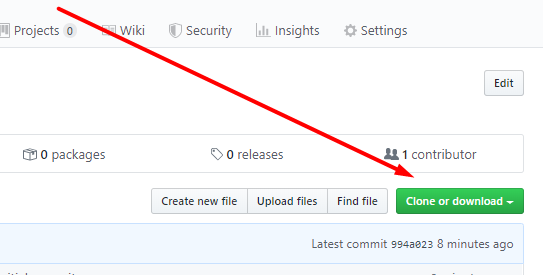
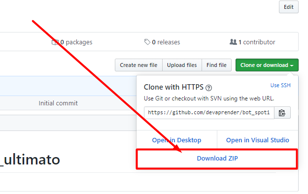

# Bem vindo 

Descubra como o poder da programação pode **Zuar o Leonardo** e a **Quaquer outra pessoa que mere&ccedil;e!**

---

# Instruções de como usar este script:

 - Se já usou o github antes já deve saber como fazer o download deste arquivo.
 - Se você nunca usou o GitHub(este site) antes, veja o que fazer abaixo

# Como baixar os arquivos

1. Clique no botão verde para fazer o download

    

2. Clique em Download ZIP

    

---

# Mini-Tutorial de como usar o bot

1. Após ter feito o download dos arquivos vá até a pasta onde você fez o download e extraia o arquivo.
2. Altere a mensagem que deseja enviar para cada grupo de acordo com o que foi [instruído nesse vídeo](https://www.youtube.com/watch?v=ISYHWfWvp3E&t=307s), assista o vídeo [clicando aqui](https://www.youtube.com/watch?v=ISYHWfWvp3E&t=307s).
3. Altere o nome do grupos para os quais quer enviar a mensagem de acordo com o que foi [instruído no vídeo](https://www.youtube.com/watch?v=ISYHWfWvp3E&t=307s), assista o vídeo [clicando aqui](https://www.youtube.com/watch?v=ISYHWfWvp3E&t=307s).
---
